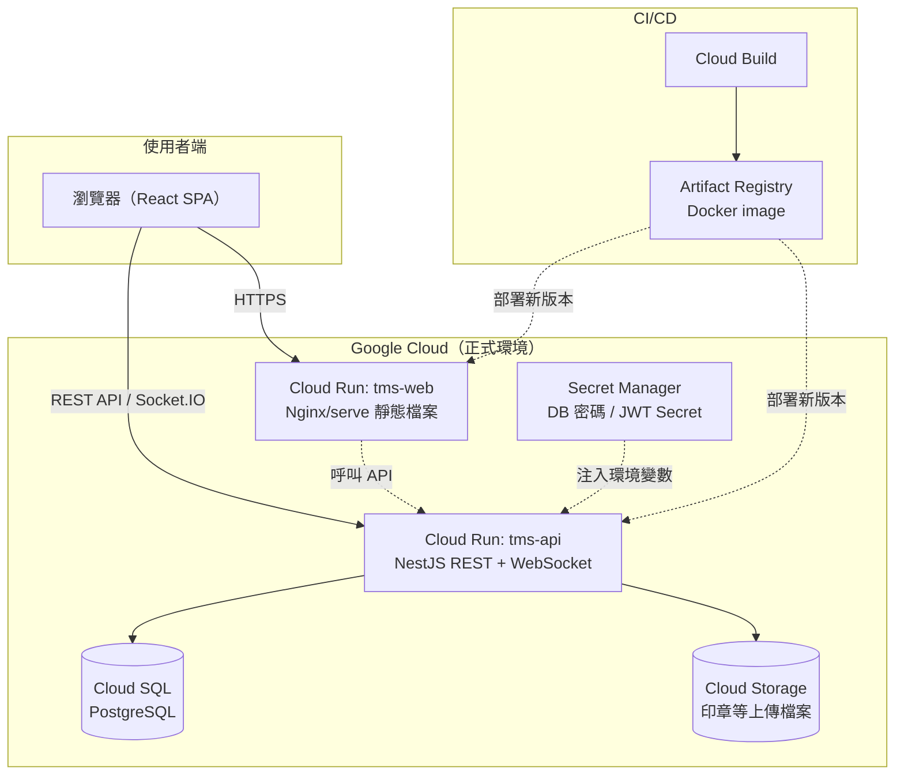

# 宮廟管理系統（TMS — Temple Management System）

供實體宮廟日常營運使用的全端管理系統，涵蓋活動報名、點燈認領、捐款與送禮、收據開立與財務稽核、信徒與戶籍管理等完整業務流程，目前已實際部署上線供真實宮廟使用。

## 功能特色

- **活動報名**
  - 可設定固定金額或隨喜收費、桌次與每桌人數，報名時自動配位或手動選位
  - 可設定報名期限，期限一到（或日期已過、或手動標記）自動從報名頁隱藏，列表也會標示「已過期」
  - 單一活動的報名名單、座位表、活動捐款、活動支出一次查詢
- **點燈牆**
  - 以畫布拖曳的方式自訂燈牆排列形狀（不限制規則矩形）
  - 多櫃台同時操作時，以 WebSocket 即時同步座位/燈位認領狀態，並以資料庫唯一約束防止競爭條件下的重複配位
  - 「太歲燈牆」可標記鎖定點燈內容；一般燈牆的點燈內容可複選
  - 支援整戶（依戶籍人數）一次認領多個燈位
- **捐款與送禮**：油香/普渡/進香/修繕/建設等捐款分類，送禮（花籃、壽桃、水、飲料等）紀錄
- **收據管理**：單筆或合併開立收據、收據作廢（保留稽核紀錄並釋放座位/燈位）、永久刪除（總幹事限定）、補印
- **信徒與戶籍管理**：戶籍底下管理多位信徒，依生日自動換算生肖與是否「犯太歲」
- **財務管理**：流水帳收支、零用金撥補與餘額追蹤、每日稽核紀錄、依期間/分類統計收入報表
- **物資庫存**：進貨/領用紀錄、低庫存提醒
- **權限管理**：五種角色（總幹事、財務、志工、資料建檔、報名櫃檯）+ 一種唯讀角色（可檢視全部頁面與資料，但任何新增/修改/刪除請求一律在後端被攔截拒絕，不是只靠前端隱藏按鈕）
- **多廟支援**：單一系統可同時管理多間廟宇的資料，彼此隔離

## 系統架構



- **前端**：React 18 + TypeScript + Vite + Ant Design，TanStack Query 處理資料請求與快取
- **後端**：NestJS + TypeORM + PostgreSQL，JWT + Passport 做身分驗證，Socket.IO 處理即時座位/燈位同步
- **Monorepo**：以 pnpm workspace 管理 `apps/web`、`apps/api`、`packages/shared`（前後端共用的 TypeScript 型別定義與列舉，確保 API 契約一致）
- **部署**：Docker 容器化，透過 Cloud Build 建置、推送至 Artifact Registry，部署到 Cloud Run；資料庫為 Cloud SQL（PostgreSQL），機密資訊由 Secret Manager 管理，資料庫 schema 以 TypeORM migration 版本化管理

## 技術棧

| 分類 | 技術 |
| --- | --- |
| 前端 | React, TypeScript, Vite, Ant Design, TanStack Query, Axios, dayjs, Socket.IO Client |
| 後端 | NestJS, TypeORM, PostgreSQL, Passport/JWT, Socket.IO, class-validator |
| 匯出/列印 | xlsx, jspdf, html2canvas, docx |
| 基礎設施 | Docker, Google Cloud Run, Cloud SQL, Cloud Build, Artifact Registry, Secret Manager |

## 本機啟動方式

需求：Node.js 20+、pnpm、Docker（跑本機 PostgreSQL）

```bash
# 1. 安裝套件（monorepo 一次安裝所有 workspace）
pnpm install

# 2. 啟動本機 PostgreSQL（docker-compose，對外埠號 5433）
pnpm db:up

# 3. 設定後端環境變數
cp apps/api/.env.example apps/api/.env

# 4. 建立資料庫 schema（依 migration 版本建表）
pnpm --filter @tms/api migration:run

# 5.（選用）建立示範帳號與示範資料
pnpm --filter @tms/api seed

# 6. 啟動後端（http://localhost:3001）
pnpm dev:api

# 7. 另開一個終端機啟動前端（http://localhost:5174，已設定 proxy 轉發 /api、/socket.io 到後端）
pnpm dev:web
```

執行過 `seed` 後可用以下示範帳號登入（僅供本機開發使用，**正式環境密碼不同**）：

| 帳號 | 密碼 | 角色 |
| --- | --- | --- |
| director | director123 | 總幹事/主委 |
| finance | finance123 | 財務人員 |
| volunteer | volunteer123 | 志工/櫃台人員 |

## 畫面截圖

> 以下為去識別化後的畫面截圖（使用開發環境的示範資料，不含任何真實信眾個資）。

<!--
screenshots 尚待補上，預計放在 docs/screenshots/ 底下，例如：


-->

## 關於這個 repository 的開發歷程

這個 GitHub repository 是在專案開發到一定階段後才建立版本控制並發佈的，所以目前的 commit 數量不多，**但這不代表實際開發時間很短**：

- 專案最早的資料庫 migration 建立於 2026 年 7 月初，此後陸續開發活動報名、點燈牆、財務管理、庫存、權限管理等模組，持續迭代到 2026 年 10 月
- 開發過程中大量採用與 AI（Claude Code）協作的方式進行結對開發（規格討論、實作、code review、修 bug、部署），實際開發歷程可對應到與 AI 的對話紀錄，而非單一 commit 一次性上傳
- 因為一開始沒有建立 git 版本控制，中途才補上，所以歷史 commit 無法完整還原每一次程式碼變更；之後會以較小顆粒度的 commit 持續記錄後續的開發與維護

## 專案結構

```
apps/
  web/     React 前端
  api/     NestJS 後端
packages/
  shared/  前後端共用的 TypeScript 型別與列舉
```
